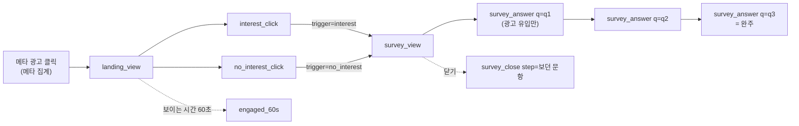

# 이벤트 택소노미

작성 2026-09-30 · 상태: 1차 확정(2026-09-30 결정 3건 반영)

성분돋보기가 Amplitude와 메타 픽셀로 보내는 이벤트와 속성의 정의서입니다. **이벤트와 속성의 기준(SSOT)은 이 폴더입니다.** 코드와 이 문서가 다르면 둘 중 하나가 틀린 것이고 같은 PR에서 맞춥니다.

| 파일 | 내용 |
|---|---|
| [events.csv](events.csv) | 이벤트와 속성 표. 한 줄이 "이벤트 하나 × 속성 하나". 구글 시트나 엑셀로 열 수 있음 |
| README.md (이 파일) | 이름 규칙, 이벤트 패스, 설계 판단, 변경 절차, 변경 이력 |

UTM 운영 규칙, 설문 문구, 지표 해석은 [계측 설계 초안](../tracking-plan-draft.md)(노션 원본)이 맡습니다. 이 문서는 "무엇을 어떤 이름과 값으로 보내는가"만 다룹니다. 노션 계측 설계 페이지의 이벤트 표는 2026-09-30부터 이 폴더 링크로 바뀌었습니다.

참고: 마티니 블로그 이벤트 택소노미 연재(네이버 시리즈 편 2개, 버거킹 편 3개)와 택소노미 샘플 CSV. 샘플의 열 구성을 따르고 우리에게 필요한 열 4개(Required, Analysis, Status, Since)를 더했습니다.

---

## 1. 목적

택소노미는 분석 도구일 뿐 그 자체가 목적이 아닙니다. 이 서비스가 데이터로 답하려는 질문은 하나입니다.

> 화장품 광고에서 성분 언어(A: "PDRN 연어크림")와 리뷰 언어(B: "바르면 쫀쫀해지고 광이 나는 크림") 중 무엇이 반응을 더 끄는가

화해 비즈니스 글(2026-04-13)이 "원료사 카피 대신 리뷰 언어를 쓰라"고 권한 것을 출시 전에 시험합니다. B는 원래 효능 언어("피부탄력 케어 크림")였고 2026-09-30에 리뷰 언어로 바꿨습니다. 2026-10-01에 B 문구를 확정했습니다. 기준은 화해 글이 예로 든 표현 유형(바른 뒤의 밀착감, 광)이고 낱말은 화해 PDRN 크림 리뷰 약 110개에 실제로 나온 말에서 골랐습니다. 가장 많이 나온 말은 아니고 근거는 리뷰 6개와 4개입니다.

- 광고 노출과 클릭(CTR)은 메타 광고 관리자 숫자를 씁니다.
- 이 택소노미는 **랜딩에 도착한 뒤의 행동**과 **설문 응답**을 소재별로 나눠 보기 위한 것입니다.
- 그래서 모든 이벤트가 "A와 B 중 어느 소재로 왔는가(variant)"와 "몇 차 테스트인가(round)"를 들고 다닙니다.

## 2. 이벤트 패스

최종 전환은 **관심 버튼 클릭(interest_click)** 하나입니다. 설문은 전환 뒤에 "왜"를 묻는 보조 퍼널입니다.

| 이벤트 카테고리 | 퍼널 | 이벤트 |
|---|---|---|
| 관심 전환 | landing_view → interest_click | landing_view, interest_click, no_interest_click, engaged_60s, section_view |
| 설문 | survey_view → survey_answer(q3) | survey_view, survey_answer, survey_close |
| 글 | note_view → note_link_click → (/concept의 landing_view, utm_source=notes) | note_view, note_link_click |
| 세션 (자동) | Amplitude가 기록 | session_start, session_end |
| 광고 최적화 | 메타 픽셀 | PageView, InterestClick(제안) |

## 3. 이름 규칙

### 이벤트
- 영어 소문자와 밑줄(snake_case). 형식은 `{대상}_{행동}`이고 행동은 동사 원형으로 씁니다.
  - 지금 쓰는 행동어: `view`(화면이나 카드가 보임), `click`(누름), `answer`(답함), `close`(닫음)
  - 예외: 시간 기준 도달은 `engaged_{시간}` (engaged_60s)
- 새 이벤트도 이 형식을 따르고 위 행동어를 먼저 씁니다. 새 행동어가 필요하면 이 목록에 먼저 추가합니다.
- 이름만 보고 트리거(보임인지 누름인지)를 알 수 있어야 합니다.
- Amplitude 자동 이벤트(`session_start`, `session_end`)는 Amplitude가 정한 이름 그대로 둡니다. 화면에는 "Start Session", "End Session"으로 보입니다. 우리 이벤트에 `session_`으로 시작하는 이름을 쓰지 않습니다.

### 속성
- 영어 소문자와 밑줄. 값도 영어 소문자 코드로 보내고 화면 문구(한글)는 보내지 않습니다. 문구는 바뀌어도 코드는 그대로 둡니다.
- 값이 없으면 `(none)`을 보냅니다. 빈 문자열이나 null과 섞이지 않게 하려는 것입니다. 예외는 is_test 하나입니다(아래 5절).
- 같은 뜻에는 같은 이름을 씁니다. 예: 설문 문항은 어느 이벤트에서든 `q1`, `q2`, `q3`입니다(survey_answer의 q, survey_close의 step).

### Trigger 열 값
| 값 | 뜻 |
|---|---|
| view | 화면이나 카드가 사용자에게 보일 때 |
| click | 사용자가 누를 때 |
| timer | 시간 조건을 채웠을 때 |
| auto | 도구가 스스로 기록 (우리 코드 아님) |
| - | 이벤트가 아니라 공통 속성 정의 줄 |

## 4. 설계 판단 (왜 이렇게 했나)

### 4.1 소재(A/B)는 이벤트가 아니라 속성으로 나눈다
버거킹 사례는 킹오더와 딜리버리를 `k_`, `d_` 이벤트로 쪼갰습니다. 두 퍼널을 늘 따로 보기 때문입니다. 우리는 반대입니다. A와 B는 **항상 나란히 비교**하는 대상이라 한 이벤트에 variant 속성을 두고 Amplitude에서 "variant로 나눠 보기" 한 번으로 두 줄을 겹쳐 봅니다. 이벤트를 쪼개면 비교할 때마다 둘을 다시 합쳐야 합니다.

### 4.2 view 이벤트는 분모가 필요할 때만
view는 새로 고침마다 쌓이고 의도를 알 수 없어 비용 대비 효용이 낮을 수 있습니다. 처음에는 다음 두 개만 두었고 아래 예외 두 가지(note_view, section_view)가 더해졌습니다.
- landing_view: 소재별 방문 수의 분모. 광고 클릭 수(메타)와 도착 수를 맞춰 보는 유일한 값
- survey_view: 설문 응답률의 분모. 설문은 관심 버튼과 20초 타이머 두 경로로 뜨므로 view 하나로 받는 편이 경로별 click을 두는 것보다 단순함

Amplitude의 페이지 조회 자동 수집은 landing_view와 겹쳐서 끕니다.

**예외: 페이지 종류가 다르면 view를 따로 둡니다(2026-10-05).** 검색용 글 페이지(`/notes/`)는 광고 도착 페이지가 아니라서 note_view로 따로 셉니다. landing_view에 섞으면 블로그나 스레드에서 콘셉트에 도착한 수를 셀 때 글 조회가 함께 잡힙니다. note_view는 글에서 콘셉트로 넘어간 비율(note_link_click)의 분모라 4.2의 조건(분모가 필요함)에도 맞습니다.

**예외: 구역 노출은 속성 하나로 받습니다(2026-10-06).** section_view는 콘셉트 페이지의 구역(관심 버튼, 제품 소개, 푸터)이 화면에 절반 이상 들어올 때 구역마다 한 번 보냅니다. 관심 버튼을 본 기기 수가 관심 클릭률의 분모가 되므로 4.2의 조건에 맞습니다. 구역마다 이벤트를 따로 만들지 않고 section 속성으로 나눕니다(4.1과 같은 이유). 첫 화면의 머리와 사진은 landing_view와 같은 수라서 넣지 않았고 설문 카드는 survey_view가 이미 있습니다. 2026-10-06 배포 뒤 방문에만 있으므로 구역 비율의 분모는 같은 기간의 landing_view로 잡습니다. 관심 버튼이 첫 화면에 들어오는 기기에서는 cta가 landing_view와 같은 수가 됩니다(375x812, 360x640에서 확인). 그런 기기에서 구분력이 있는 값은 info와 footer입니다.

### 4.3 모든 행동을 잡지 않는다
분석 목적이 없는 이벤트는 만들지 않습니다. events.csv의 Analysis 열이 비면 그 이벤트는 추가하지 않습니다. 지금 **일부러 넣지 않은 것**:

| 후보 | 넣지 않은 이유 |
|---|---|
| 스크롤 깊이(%) | 화면 크기마다 같은 %가 다른 내용을 가리킴. 어디까지 보았는지는 구역 노출(section_view)로 봄. 2026-10-06 전에는 engaged_60s로 충분하다고 보고 넣지 않았음 |
| 처리방침 링크 클릭 | 실험 질문과 무관 |
| 설문 완료 이벤트 | 문항 순서가 고정이라 survey_answer(q=q3)가 곧 완주 |
| 선택지가 몇 번째 자리에 있었는지 | 순서를 섞어서 쏠림을 줄였고 자리별 쏠림 자체를 분석할 계획은 없음 |
| Amplitude 요소 클릭 자동 수집 | 모든 클릭이 쌓여 우리 이벤트와 겹침. 꺼 둠 |

### 4.4 사용자 속성은 우리 코드가 넣지 않는다
블로그의 기준: 행동과 상관없이 오래 유지되는 값은 사용자 속성, 이벤트마다 달라지는 값은 이벤트 속성.
- UTM, variant, round는 같은 사람이라도 다른 광고로 다시 올 수 있어 **이벤트 속성**입니다.
- 설문 Q3(성분표 확인 습관)은 오래 유지되는 성향이라 사용자 속성 후보였습니다. 그러나 Amplitude의 사용자 속성은 **설정한 뒤에 일어난 이벤트에만** 붙습니다. 설문은 대부분 관심 버튼을 누른 뒤에 뜨므로 interest_click에는 붙지 않습니다.
- 그래서 "성분표를 자주 보는 사람의 관심 클릭률"은 Amplitude 코호트(survey_answer에서 q=q3, answer=always를 한 기기)로 봅니다. 코호트는 과거 이벤트에도 적용됩니다.

Amplitude가 스스로 붙이는 사용자 속성(참고):

| 속성 | 뜻 |
|---|---|
| initial_utm_source 등 initial_* | 첫 방문 때의 UTM과 유입 경로. 두 번째 방문부터 섞일 수 있어 분석은 이벤트 속성 UTM으로 함 |
| referrer, referring_domain | 유입 경로. 검색(SEO) 유입은 UTM이 없어 이것으로 구분 |
| device, os, country 등 | 기기와 지역. 개인을 알아볼 정보는 아님 |

### 4.5 속성을 앞 이벤트에서 물려받지 않는다
버거킹 사례처럼 앞 단계 속성을 뒤 이벤트에 계속 쌓는 방식은 퍼널 순서를 강제합니다. 우리 퍼널은 짧고 모든 이벤트가 같은 공통 속성 9개를 들고 다니므로 물려받을 것이 없습니다. 이벤트별 속성은 그 이벤트에서 생긴 정보만 넣습니다.

## 5. 분석할 때 지킬 것

- **테스트 제외**: is_test는 테스트 방문에만 true로 붙고 일반 방문에는 아예 없습니다. 필터는 "is_test가 true인 것 제외"로 겁니다. "is_test = false인 것만"으로 걸면 일반 방문(값 없음)까지 빠집니다.
- **기기 기준**: landing_view와 interest_click은 새로 고침하면 다시 쌓일 수 있으니 이벤트 수가 아니라 기기 수(Uniques)로 셉니다.
- **설문 코드**: answer의 `ingredient`, `effect`, `other`는 q1과 q2에 모두 있습니다. 항상 q로 먼저 거릅니다.
- **(none)**: SNS나 검색 유입은 round, variant가 `(none)`입니다. A/B 비교에서는 variant가 `(none)`이 아닌 것만 봅니다. 1차는 ingredient와 texture, 2차는 ingredient와 review입니다.
- **링크 점검**: 2026-10-09부터 landing_page는 페이지가 광고 이름에서 직접 정합니다. round가 r2인데 landing_page가 common이면 광고 이름이 규칙에 맞지 않아 공통 문구가 나간 것입니다.

## 6. 변경 절차 (문서와 개발을 잇는 방법)

### 원칙
- 이벤트나 속성을 추가, 변경, 삭제하는 **코드 PR은 같은 PR에서 events.csv를 고칩니다.** 문서만 먼저 바꾸는 것은 괜찮고(Status=proposed) 코드만 바꾸는 것은 안 됩니다.
- 실제 데이터가 쌓인 이벤트는 행을 지우지 않습니다. 코드에서 뺐으면 Status를 `deprecated`로 바꾸고 Note에 날짜와 이유를 적습니다. 과거 데이터를 해석할 근거가 남아야 하기 때문입니다.
- 이름은 한 번 쓰면 바꾸지 않습니다. 바꿔야 하면 새 이름을 추가하고 옛 이름을 deprecated로 둡니다. Amplitude에서는 두 이름이 따로 쌓입니다.

### Status 값
| 값 | 뜻 |
|---|---|
| proposed | 문서에만 있음. 아직 코드에 없음 |
| active | 운영 코드가 보내는 중. Since에 배포 날짜 |
| deprecated | 코드에서 뺐음. 행은 남김 |
| rejected | 검토했지만 넣지 않기로 함. 같은 제안이 다시 나오지 않게 이유를 Note에 남김 |

### 새 이벤트를 넣기 전 확인 (5문항)
1. 이 데이터로 어떤 결정을 바꾸나? (Analysis 열에 한 줄로 못 쓰면 넣지 않음)
2. 이미 있는 이벤트에 속성 하나를 더하는 것으로 대신할 수 있나?
3. view인가 click인가? view라면 4.2의 이유(분모가 필요하거나 여러 경로로 들어옴)에 해당하나?
4. 값에 개인을 알아볼 정보나 자유 입력이 들어가나? 들어가면 넣지 않음
5. 처리방침의 수집 항목(1절)에 이미 포함되나? 아니면 처리방침을 같은 PR에서 고침

### 자동 점검 (2026-09-30 적용)
- `python3 scripts/check_taxonomy.py`가 `landing/` 아래 모든 HTML(하위 폴더 포함, 2026-10-05부터)의 코드를 합쳐 events.csv와 대조합니다. PR에서 `landing/`, `docs/taxonomy/`, `scripts/`를 건드리면 GitHub Actions(taxonomy)가 같은 점검을 돌리고 어긋나면 PR에 실패 표시가 붙습니다.
- 대조하는 것
  - `track()`, `trackOnce()`로 보내는 이벤트 이름과 이벤트별 속성 키 ↔ Status가 active인 SDK 행
  - `COMMON`에 들어가는 공통 속성 키 ↔ Event Name이 `*`인 active 행
  - `fbq('track'/'trackCustom', ...)` 이벤트 ↔ active인 Meta Pixel 행
- 표 자체도 검사합니다: 열 구성, Status 값, SDK 이벤트와 속성의 snake_case, active와 proposed 행의 Analysis, 같은 이벤트와 속성의 중복 행
- 대조하지 않는 것: 속성 값(Value Example), Amplitude 자동 수집 이벤트(session_start 등). 값 목록을 바꿀 때는 사람이 표를 고칩니다.
- 코드 쓰는 법: 이벤트는 `track('이벤트_이름', { 키: 값 })`처럼 이름은 따옴표 문자열로, 속성은 한 겹짜리 객체로 넘깁니다. 이름을 변수로 넘기거나 객체 안에 중괄호가 또 있으면 점검이 읽지 못해 실패로 표시됩니다. 주석 처리된 호출과 `<script>` 밖의 글자는 세지 않습니다.
- 저장소 `CLAUDE.md`와 PR 템플릿에 같은 규칙을 적어 두었습니다.
- 머지한 뒤에는 Amplitude 트래킹 플랜(성분돋보기 프로젝트)에도 반영해 새 이벤트가 "unexpected"로 뜨지 않게 합니다.

## 7. 결정 사항

| 항목 | 결정 (2026-09-30) | 이유 |
|---|---|---|
| 이벤트 이름 형식 | 지금 형식(`{대상}_{행동}` 동사 원형) 유지. 과거형(`landing_viewed`)으로 바꾸지 않음 | 트리거가 이미 이름에 드러나 바꿔서 얻는 것이 적음. 캠페인 뒤에 바꾸면 데이터가 둘로 갈림 |
| 기준 문서 위치 | 이벤트와 속성 정의는 이 폴더(events.csv)가 기준. 노션 계측 설계 페이지의 이벤트 표는 이곳 링크로 바꿈 | 코드 PR에서 같이 고칠 수 있고 2단계 자동 점검이 저장소 파일만 읽을 수 있음 |
| 메타 InterestClick | 보내지 않음(events.csv에 rejected) | Amplitude에 같은 데이터가 있음. 메타 전환 최적화에 쓰기엔 수가 적고, 최적화를 켜면 A/B 노출 조건이 더 달라짐. 처리방침 6절도 고쳐야 함 |

## 8. 변경 이력

| 날짜 | 내용 |
|---|---|
| 2026-10-09 | 2차 랜딩(배포 날짜는 예정). 버튼을 "더 보고 싶어요"(interest_click, 문구만 바뀜)와 "관심 없어요"(새 이벤트 no_interest_click) 둘로 나눔. 버튼 줄은 화면 아래에 붙어 따라오고 하나를 누르면 사라짐. 설문은 버튼을 누른 직후에만 뜸(survey_view의 trigger에 no_interest 추가, timer는 더 보내지 않음). 제품 설명 구역(section=info, 화면 제목은 "조금 더 보여 드릴게요")은 "더 보고 싶어요"를 누른 뒤에만 열리고 예상 가격을 더함. 첫 화면 문구를 광고 이름의 글 값에 맞춰 ingredient, review, common으로 나누고 landing_page를 페이지가 직접 정함. 새 이벤트 확인 5문항: (1) 안 누르고 떠난 기기와 관심 없다고 답한 기기를 나눠 랜딩 문구를 고칠지 정함 (2) interest_click에 속성을 더하면 1차 기록과 뜻이 달라져 따로 둠 (3) click (4) 개인 정보나 자유 입력 없음 (5) 처리방침 1절의 버튼 누름을 두 버튼으로 고침 |
| 2026-10-06 | Amplitude 트래킹 플랜에 section_view를 등록(카테고리 관심 전환). section은 허용 값 목록(cta, info, footer)이고 필수 |
| 2026-10-06 | 이벤트 section_view(속성 section: cta, info, footer) 추가. 피드백(랜딩 안에서 어디서 이탈하는지 보아야 랜딩을 고칠 수 있음)에 따라 4.3의 "스크롤 깊이는 넣지 않음"을 구역 노출로 바꿈. 4.2에 예외 추가. 화면은 바꾸지 않음. 배포 뒤 방문에만 기록됨. 처리방침 1절에 "페이지의 어느 구역까지 보았는지" 추가 |
| 2026-10-05 | 검색용 글 페이지(`/notes/pdrn-cream-reviews`) 추가. 이벤트 note_view(속성 note), note_link_click(속성 note, target) 추가. 4.2에 "페이지 종류가 다르면 view를 따로 둔다" 예외. 글 페이지 이벤트의 공통 속성은 콘셉트와 같은 키이고 landing_page는 (none). 글에서 콘셉트로 가는 링크 값 utm_source=notes, utm_medium=owned, utm_campaign=organic, utm_content=n01. 자동 점검이 landing/ 하위 폴더도 보게 바꿈. 글 페이지에는 메타 픽셀을 넣지 않음 |
| 2026-10-02 | 광고 이름 규칙을 바꾸고 UTM을 광고 관리자의 이름과 같은 글자로 맞춤(강사님 피드백: 이름이 실험 계획을 드러내고 그 내용이 UTM에 들어가야 함). utm_campaign은 캠페인 이름, utm_term은 광고 세트 이름, utm_content는 광고 이름. 공통 속성 utm_term 추가(8개 → 9개). utm_content는 r1_name, r1_review에서 img_ingredient_text_common_r1_v1, img_texture_text_common_r1_v1로(규칙: img_그림_text_글_차수_버전). variant 값은 name, review에서 ingredient, texture, review로(A와 B가 다른 쪽의 값: 1차는 그림 값, 2차는 글 값). landing_page 값 name → ingredient. 첫 화면 사진은 이름의 그림 값으로 고름. 게시 전이라 옛 값으로 쌓인 데이터는 테스트뿐. 규칙은 ads/README.md |
| 2026-10-01 | B 문구 확정("바르면 쫀쫀해지고 광이 나는 크림"). 이벤트와 속성은 바뀌지 않음 |
| 2026-09-30 | B 소재를 효능 언어에서 리뷰 언어로 바꿈. variant와 landing_page 값 benefit → review, utm_content r1_benefit → r1_review(r2도 같음). 설문 Q1에 texture(사용감) 선택지 추가. 광고 전이라 옛 값으로 쌓인 데이터는 테스트뿐 |
| 2026-09-30 | Amplitude 트래킹 플랜(성분돋보기)에 이벤트 7개와 속성 12개를 등록. round, variant, landing_page, trigger, q, answer, step은 허용 값 목록(enum)으로 둠. 세션 끝(session_end)은 아직 들어온 적이 없어 등록하지 않음 |
| 2026-09-30 | 자동 점검 추가(scripts/check_taxonomy.py, GitHub Actions taxonomy, 저장소 CLAUDE.md, PR 템플릿). 6절 "개발 단계에서 붙일 것"을 "자동 점검"으로 바꿈 |
| 2026-09-30 | 7절 결정 3건 반영. Status에 rejected 추가. InterestClick을 rejected로. 세션 자동 이벤트 이름을 session_start, session_end로 바로잡음(Amplitude MCP로 확인) |
| 2026-09-30 | 1차 초안. 운영 중인 이벤트 6개, 공통 속성 8개, Amplitude 자동 이벤트 2개, 메타 픽셀 2개(1개 제안)를 코드 기준으로 정리 |
