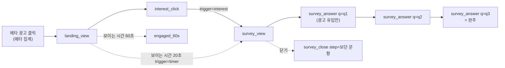

# 이벤트 택소노미

작성 2026-09-30 · 상태: 1차 초안(검토 전)

성분돋보기가 Amplitude와 메타 픽셀로 보내는 이벤트와 속성의 정의서입니다. **이벤트와 속성의 기준(SSOT)은 이 폴더입니다.** 코드와 이 문서가 다르면 둘 중 하나가 틀린 것이고 같은 PR에서 맞춥니다.

| 파일 | 내용 |
|---|---|
| [events.csv](events.csv) | 이벤트와 속성 표. 한 줄이 "이벤트 하나 × 속성 하나". 구글 시트나 엑셀로 열 수 있음 |
| README.md (이 파일) | 이름 규칙, 이벤트 패스, 설계 판단, 변경 절차, 변경 이력 |

UTM 운영 규칙, 설문 문구, 지표 해석은 [계측 설계 초안](../tracking-plan-draft.md)(노션 원본)이 맡습니다. 이 문서는 "무엇을 어떤 이름과 값으로 보내는가"만 다룹니다.

참고: 마티니 블로그 이벤트 택소노미 연재(네이버 시리즈 편 2개, 버거킹 편 3개)와 택소노미 샘플 CSV. 샘플의 열 구성을 따르고 우리에게 필요한 열 4개(Required, Analysis, Status, Since)를 더했습니다.

---

## 1. 목적

택소노미는 분석 도구일 뿐 그 자체가 목적이 아닙니다. 이 서비스가 데이터로 답하려는 질문은 하나입니다.

> 화장품 광고에서 성분 이름(A: "PDRN 연어크림")을 앞세우면 효능(B: "피부탄력 케어 크림")을 앞세울 때보다 반응이 좋은가

- 광고 노출과 클릭(CTR)은 메타 광고 관리자 숫자를 씁니다.
- 이 택소노미는 **랜딩에 도착한 뒤의 행동**과 **설문 응답**을 소재별로 나눠 보기 위한 것입니다.
- 그래서 모든 이벤트가 "A와 B 중 어느 소재로 왔는가(variant)"와 "몇 차 테스트인가(round)"를 들고 다닙니다.

## 2. 이벤트 패스

최종 전환은 **관심 버튼 클릭(interest_click)** 하나입니다. 설문은 전환 뒤에 "왜"를 묻는 보조 퍼널입니다.

| 이벤트 카테고리 | 퍼널 | 이벤트 |
|---|---|---|
| 관심 전환 | landing_view → interest_click | landing_view, interest_click, engaged_60s |
| 설문 | survey_view → survey_answer(q3) | survey_view, survey_answer, survey_close |
| 세션 (자동) | Amplitude가 기록 | [Amplitude] Start Session, [Amplitude] End Session |
| 광고 최적화 | 메타 픽셀 | PageView, InterestClick(제안) |

## 3. 이름 규칙

### 이벤트
- 영어 소문자와 밑줄(snake_case). 형식은 `{대상}_{행동}`이고 행동은 동사 원형으로 씁니다.
  - 지금 쓰는 행동어: `view`(화면이나 카드가 보임), `click`(누름), `answer`(답함), `close`(닫음)
  - 예외: 시간 기준 도달은 `engaged_{시간}` (engaged_60s)
- 새 이벤트도 이 형식을 따르고 위 행동어를 먼저 씁니다. 새 행동어가 필요하면 이 목록에 먼저 추가합니다.
- 이름만 보고 트리거(보임인지 누름인지)를 알 수 있어야 합니다.
- Amplitude 자동 이벤트는 `[Amplitude] ...` 이름 그대로 두고 우리 이벤트와 섞지 않습니다.

### 속성
- 영어 소문자와 밑줄. 값도 영어 소문자 코드로 보내고 화면 문구(한글)는 보내지 않습니다. 문구는 바뀌어도 코드는 그대로 둡니다.
- 값이 없으면 `(none)`을 보냅니다. 빈 문자열이나 null과 섞이지 않게 하려는 것입니다. 예외는 is_test 하나입니다(아래 5절).
- 같은 뜻에는 같은 이름을 씁니다. 예: 설문 문항은 어느 이벤트에서든 `q1`, `q2`, `q3`입니다(survey_answer의 q, survey_close의 step).

### Trigger 열 값
| 값 | 뜻 |
|---|---|
| view | 화면이나 카드가 사용자에게 보일 때 |
| click | 사용자가 누를 때 |
| timer | 시간 조건을 채웠을 때 |
| auto | 도구가 스스로 기록 (우리 코드 아님) |
| - | 이벤트가 아니라 공통 속성 정의 줄 |

## 4. 설계 판단 (왜 이렇게 했나)

### 4.1 소재(A/B)는 이벤트가 아니라 속성으로 나눈다
버거킹 사례는 킹오더와 딜리버리를 `k_`, `d_` 이벤트로 쪼갰습니다. 두 퍼널을 늘 따로 보기 때문입니다. 우리는 반대입니다. A와 B는 **항상 나란히 비교**하는 대상이라 한 이벤트에 variant 속성을 두고 Amplitude에서 "variant로 나눠 보기" 한 번으로 두 줄을 겹쳐 봅니다. 이벤트를 쪼개면 비교할 때마다 둘을 다시 합쳐야 합니다.

### 4.2 view 이벤트는 두 개만
view는 새로 고침마다 쌓이고 의도를 알 수 없어 비용 대비 효용이 낮을 수 있습니다. 우리는 다음 두 개만 둡니다.
- landing_view: 소재별 방문 수의 분모. 광고 클릭 수(메타)와 도착 수를 맞춰 보는 유일한 값
- survey_view: 설문 응답률의 분모. 설문은 관심 버튼과 20초 타이머 두 경로로 뜨므로 view 하나로 받는 편이 경로별 click을 두는 것보다 단순함

Amplitude의 페이지 조회 자동 수집은 landing_view와 겹쳐서 끕니다.

### 4.3 모든 행동을 잡지 않는다
분석 목적이 없는 이벤트는 만들지 않습니다. events.csv의 Analysis 열이 비면 그 이벤트는 추가하지 않습니다. 지금 **일부러 넣지 않은 것**:

| 후보 | 넣지 않은 이유 |
|---|---|
| 스크롤 깊이 | 콘셉트 페이지가 한두 화면 분량이라 engaged_60s로 충분 |
| 처리방침 링크 클릭 | 실험 질문과 무관 |
| 설문 완료 이벤트 | 문항 순서가 고정이라 survey_answer(q=q3)가 곧 완주 |
| 선택지가 몇 번째 자리에 있었는지 | 순서를 섞어서 쏠림을 줄였고 자리별 쏠림 자체를 분석할 계획은 없음 |
| Amplitude 요소 클릭 자동 수집 | 모든 클릭이 쌓여 우리 이벤트와 겹침. 꺼 둠 |

### 4.4 사용자 속성은 우리 코드가 넣지 않는다
블로그의 기준: 행동과 상관없이 오래 유지되는 값은 사용자 속성, 이벤트마다 달라지는 값은 이벤트 속성.
- UTM, variant, round는 같은 사람이라도 다른 광고로 다시 올 수 있어 **이벤트 속성**입니다.
- 설문 Q3(성분표 확인 습관)은 오래 유지되는 성향이라 사용자 속성 후보였습니다. 그러나 Amplitude의 사용자 속성은 **설정한 뒤에 일어난 이벤트에만** 붙습니다. 설문은 대부분 관심 버튼을 누른 뒤에 뜨므로 interest_click에는 붙지 않습니다.
- 그래서 "성분표를 자주 보는 사람의 관심 클릭률"은 Amplitude 코호트(survey_answer에서 q=q3, answer=always를 한 기기)로 봅니다. 코호트는 과거 이벤트에도 적용됩니다.

Amplitude가 스스로 붙이는 사용자 속성(참고):

| 속성 | 뜻 |
|---|---|
| initial_utm_source 등 initial_* | 첫 방문 때의 UTM과 유입 경로. 두 번째 방문부터 섞일 수 있어 분석은 이벤트 속성 UTM으로 함 |
| referrer, referring_domain | 유입 경로. 검색(SEO) 유입은 UTM이 없어 이것으로 구분 |
| device, os, country 등 | 기기와 지역. 개인을 알아볼 정보는 아님 |

### 4.5 속성을 앞 이벤트에서 물려받지 않는다
버거킹 사례처럼 앞 단계 속성을 뒤 이벤트에 계속 쌓는 방식은 퍼널 순서를 강제합니다. 우리 퍼널은 짧고 모든 이벤트가 같은 공통 속성 8개를 들고 다니므로 물려받을 것이 없습니다. 이벤트별 속성은 그 이벤트에서 생긴 정보만 넣습니다.

## 5. 분석할 때 지킬 것

- **테스트 제외**: is_test는 테스트 방문에만 true로 붙고 일반 방문에는 아예 없습니다. 필터는 "is_test가 true인 것 제외"로 겁니다. "is_test = false인 것만"으로 걸면 일반 방문(값 없음)까지 빠집니다.
- **기기 기준**: landing_view와 interest_click은 새로 고침하면 다시 쌓일 수 있으니 이벤트 수가 아니라 기기 수(Uniques)로 셉니다.
- **설문 코드**: answer의 `ingredient`, `effect`, `other`는 q1과 q2에 모두 있습니다. 항상 q로 먼저 거릅니다.
- **(none)**: SNS나 검색 유입은 round, variant가 `(none)`입니다. A/B 비교에서는 variant가 name 또는 benefit인 것만 봅니다.
- **링크 점검**: variant와 landing_page가 어긋나면(2차에서 name 소재인데 landing_page=benefit) 광고 링크 오류입니다.

## 6. 변경 절차 (문서와 개발을 잇는 방법)

### 원칙
- 이벤트나 속성을 추가, 변경, 삭제하는 **코드 PR은 같은 PR에서 events.csv를 고칩니다.** 문서만 먼저 바꾸는 것은 괜찮고(Status=proposed) 코드만 바꾸는 것은 안 됩니다.
- 실제 데이터가 쌓인 이벤트는 행을 지우지 않습니다. 코드에서 뺐으면 Status를 `deprecated`로 바꾸고 Note에 날짜와 이유를 적습니다. 과거 데이터를 해석할 근거가 남아야 하기 때문입니다.
- 이름은 한 번 쓰면 바꾸지 않습니다. 바꿔야 하면 새 이름을 추가하고 옛 이름을 deprecated로 둡니다. Amplitude에서는 두 이름이 따로 쌓입니다.

### Status 값
| 값 | 뜻 |
|---|---|
| proposed | 문서에만 있음. 아직 코드에 없음 |
| active | 운영 코드가 보내는 중. Since에 배포 날짜 |
| deprecated | 코드에서 뺐음. 행은 남김 |

### 새 이벤트를 넣기 전 확인 (5문항)
1. 이 데이터로 어떤 결정을 바꾸나? (Analysis 열에 한 줄로 못 쓰면 넣지 않음)
2. 이미 있는 이벤트에 속성 하나를 더하는 것으로 대신할 수 있나?
3. view인가 click인가? view라면 4.2의 이유(분모가 필요하거나 여러 경로로 들어옴)에 해당하나?
4. 값에 개인을 알아볼 정보나 자유 입력이 들어가나? 들어가면 넣지 않음
5. 처리방침의 수집 항목(1절)에 이미 포함되나? 아니면 처리방침을 같은 PR에서 고침

### 개발 단계에서 붙일 것 (2단계, 이 문서 확정 뒤)
- **자동 점검**: landing 페이지의 `track()`/`trackOnce()` 호출에서 이벤트 이름과 속성 키를 뽑아 events.csv의 active 행과 대조하는 스크립트. PR마다 GitHub Actions로 돌려서 어긋나면 PR을 실패시킴
- **저장소 규칙**: 저장소 CLAUDE.md와 PR 템플릿에 "계측을 건드리면 events.csv를 같이 고친다" 체크 항목
- **Amplitude 등록(선택)**: events.csv를 Amplitude Data의 트래킹 플랜에 올려 두면 문서에 없는 이벤트가 들어올 때 "Unexpected"로 표시됨. 지금 우리 이벤트가 Unexpected로 뜨는 이유가 이것

## 7. 정할 것

| 항목 | 제안 | 기한 |
|---|---|---|
| 이벤트 이름 형식 | 지금 형식(`{대상}_{행동}` 동사 원형)을 유지. 샘플처럼 과거형(`landing_viewed`)으로 바꾸는 안도 있으나 이미 트리거가 이름에 드러나 얻는 것이 적고 노션 문서와 파트너 공유를 다시 맞춰야 함 | 바꾼다면 1차 캠페인 시작 전(그 뒤에 바꾸면 데이터가 둘로 갈림) |
| 기준 문서 위치 | 이벤트 정의는 이 폴더를 기준으로 하고 노션 계측 설계 페이지의 이벤트 표는 이곳 링크로 바꿈 | 1단계 검토 때 |
| 메타 InterestClick | 계측 설계 초안의 미결 항목 그대로. events.csv에 proposed로만 둠 | 1차 캠페인 만들기 전 |

## 8. 변경 이력

| 날짜 | 내용 |
|---|---|
| 2026-09-30 | 1차 초안. 운영 중인 이벤트 6개, 공통 속성 8개, Amplitude 자동 이벤트 2개, 메타 픽셀 2개(1개 제안)를 코드 기준으로 정리 |
